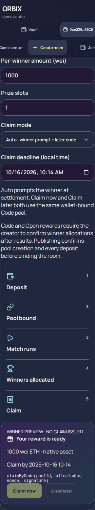
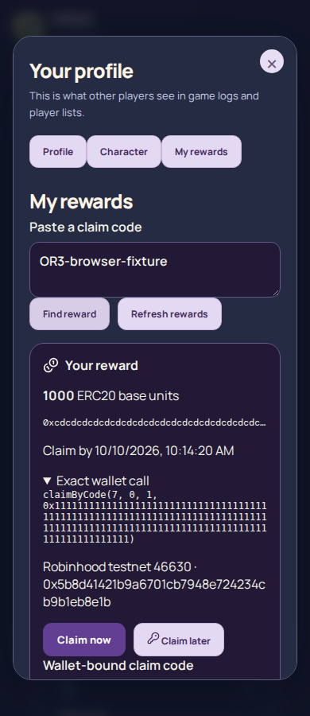

# Phase F — funded rewards client flow, 2026-10-09

User intent: **creator sets auto claim, winner gets claim prompt + claim later code redeemable against the same contract**.

Funding now prepares a stable room key without publishing a room. The creator wallet calls the deployed `RewardEngine.createPool`, approves its ERC-20 / ERC-721 / ERC-1155 reward when needed, and calls the corresponding `depositERC20`, `depositERC721`, `depositERC1155` or payable `depositETH`. Each transaction waits for a successful receipt. A saved publication body, nonce, pool ID, deposit progress and pending hashes let retries resume the original intent. The API publishes only after chain ID, creator, room key, mode, deadline, deposit receipt/event and exact `poolAssets` inventory agree. SQLite persists the unique room/pool binding. A replay returns the original room, including rooms with zero creation fees.

The wizard uses the existing CreatorEconomy CSS and Lucide icons for deposit → pool bound → match runs → winners allocated → claim. It previews the winner's asset, amount, deadline and actual claim method. Amounts use explicit token base units / ETH wei, with string and bigint arithmetic. ERC-721 supports one NFT per pool in this form; ERC-1155 supports quantities. Large NFT IDs retain their exact uint256 value in SQLite.

Authenticated `GET /api/center/v1/wallet/rewards` indexes allocated winners, reads current chain status and simulates the exact claim with `eth_call`. A room query also exposes Open slots to other connected wallets. Winner cards show pending allocation, claim availability, wallet request, submitted transaction, confirmed receipt and failure separately. “Claim later” reveals and locally saves an authority-signed wallet-bound OR3 code. Profile “My rewards” lists rewards or looks up a pasted code through `POST /api/center/v1/rewards/lookup`. Codes bind the engine, chain, pool, allocation, wallet and nonce; the contract enforces one-time allocation consumption. Claims call `claimByCode`, `claimByMerkle` or `claimOpen` and never show success before receipt status `0x1`. Error copy covers RewardEngine errors, insufficient allowance, user rejection and ORBIX curve lock `0xdb89e3f4`. The legacy escrow lookup cannot mark RewardEngine entitlements payable.

## Deployed-contract boundaries

- The requested **Auto prompt with Claim later** uses on-chain **Code mode (1)**. The deployed Auto mode (0) is `autoPush` and cannot call `claimByCode`. Both requested winner buttons redeem against the same Code pool and engine; the UI explains this explicitly. The implementation does not change the Solidity contracts.
- `setAllocation` is **creator-only**. `GET /rooms/{room_id}/reward-plan` returns the authoritative settlement plan; the host confirms its allocation transactions from the results page. The API verifies allocation events and the actual simulated claim before enabling a winner's button. A chain allocation count alone cannot mark the correct plan complete. Other winner browsers refresh pending room claims every ten seconds after results.
- Merkle roots are immutable at `createPool`; a fixed, distinct recipient list is required before funding. Proofs use RewardEngine's packed single-hash leaf, not CenterEscrow's double-hash leaf. Winners absent from that committed distribution cannot claim.
- Open slots are available to the first configured claimants, rather than reserved for match winners. The host registers zero-address allocations after the match. Open capacity is checked using the compiled ABI's `pools` getter.
- **Private-key delivery is not implemented.** The selector explains separately creating/funding a fresh wallet and arranging private off-chain delivery, and prevents publishing it as a funded contract pool. RewardEngine has no private-key delivery function. No private keys are sent to or stored by these new endpoints. A full private-key reward flow remains additional work.

## Where

- API, policy and persistence: `center/api.py`, `center/reward_flow.py`, `center/schema.py`, `center/settlement.py`, `center/store.py`.
- Creator and winner UI: `web/src/center/FundedRewards.tsx`, `fundedRewards.css`, `rewardWallet.ts`, `api.ts`, `CenterApp.tsx`, `ProfilePanel.tsx`.
- Regression tests: `center/tests/test_reward_flow.py`, `web/src/center/rewardWallet.test.mjs`.

## Verification

- Full pytest suite: **525 passed**. New chain-reader/API tests cover missing/pending/failed funding, wrong creator/room/network/mode/inventory, durable binding, replay, signed code recovery, wallet privacy, allocation readiness, signer mismatch, Merkle encoding, Open claimants, uint256 NFT IDs and the legacy escrow boundary.
- `npx --no-install tsc -b --noEmit`: passed.
- `npm run build -- --outDir /tmp/orbix-phase-f-dist`: passed. The existing Vite bundle-size warning remains. Output went to a temporary directory to preserve the pre-existing generated distribution edits; no built site was published.
- Mocked injected-wallet tests: **15 passed**, covering allowance branches, ERC-20/NFT/ETH deposits, all three pull claim modes, account/network checks, receipt polling, rejection/failure, resume, allocation writes and friendly revert messages.
- Local Chromium at **1200, 390 and 320 px**: reward controls and validation, all claim-mode previews, five lifecycle steps, profile rewards, code reveal/storage/copy/lookup, pending allocation controls, restoring a frozen publication after reload and horizontal overflow checks passed. Reward fixtures were mocked; these browser checks did not send money transactions. The same checks also passed against an isolated build of the committed source, excluding the pre-existing UI edits. Screenshots and JSON evidence are beside this record. The repeatable script is `tools/verify-phase-f.cjs` (set `ORBIX_PLAYWRIGHT_MODULE` if Playwright is installed outside the repo, and `ORBIX_PHASE_F_BASE_URL` for a different local origin).
- Live read-only Robinhood RPC: `eth_chainId` = 46630; deployed RewardEngine `authority()` = `0x253db2d543b10c94918de97eb8499ee59ab9087e`; `poolCount()` = **0**. Existing-pool inventory and claim reads are therefore verified with ABI-shaped mocked readers, not a fabricated live pool.

**Live funding, approval, allocation and claim transactions were not performed. No Railway deploy was performed.**

The checkout already contained unrelated round-immersion/UI and generated-distribution changes. They were preserved and excluded from the Phase F commits. Funding still uses the existing `CENTER_TESTNET_REWARDS` / durable database gates; code signing uses `CENTER_REWARD_SIGNER_KEY` (falling back to `CENTER_SIGNER_KEY`) and verifies the signer against `authority()`.

