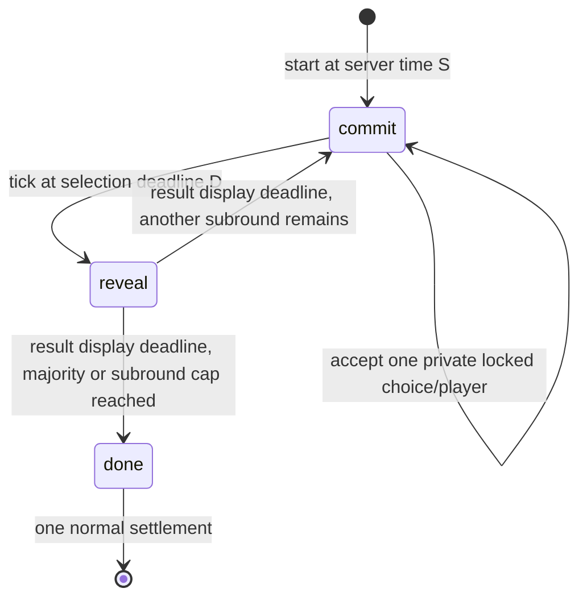

# Reaction Duel / RPS automatic reveal — 2026-10-10

Status: BUILD specification, no duel code changed in this planning round. Applies to new `reaction-duel` matches and the compatible `rps-duel` entry. One player-facing Rock Paper Scissors game remains prominent; retain the older template ID for links/history. Related: [portfolio strategy](game-portfolio-strategy.md), [immersion](fullscreen-immersion.md).

## Required behavior

A player chooses within the selection window. The server locks that selection and automatically reveals/resolves it when the window closes, even if the tab is asleep, closed, disconnected or minimized. There is **no Reveal button**, and no second client action is required. Auto-reveal guarantees resolution, not a win: the committed choices still decide the matchup.

Recommend **no choice → forfeit the subround**. Do not auto-pick: that rewards inactivity, offers a free random strategy, and makes “choose before the timer ends” misleading. If exactly one player chose, that player wins the subround by forfeit. If neither chose, record `double-no-choice`, no winner and no win increment. Two identical choices draw. A draw consumes one of the configured subrounds; do not add unbounded sudden death.

## What currently fails

`center/games/duel.py:DuelEngine` and `center/games/rps_duel.py:RpsDuelEngine` already receive **choice and salt in cleartext on the authenticated commit request**, hash them with SHA-256 and retain only the digest. Their docstrings mentioning keccak or saying cleartext is not accepted are inaccurate. The server already sees the player's move; this is trusted-server sealing, not trustless two-party secrecy from the server.

Both engines open reveal as soon as the second commit arrives. Their `tick()` timeout paths count commits/reveals or void a round; they cannot recover a preimage from a hash. Hiding the button or adding a client `useEffect` alone cannot fix this. The preimage must be retained privately by the authority at selection time.

`GamePlayStages.tsx:DuelPlay` stores the choice/salt in sessionStorage and explicitly sends a reveal click. `stages.tsx:DuelStage` and `RpsStage` expose additional manual reveal flows. `center/practice.py` manually commits and reveals bot choices, and only advances its engine on practice requests. `RoomRuntime.tick` already checkpoints time-driven nonarena transitions and broadcasts their patches, making it the correct server mechanism; timers must not live solely in React.

Legacy eligibility differs: Reaction Duel requires a unique positive match leader; RPS Duel allows every participant with a subround win. New auto-reveal versions must deliberately converge on the unique-match-winner policy below. Do not silently rewrite old settled allocations.

## Frozen rule and action contract

Keep existing choice-window bounds 5–20 s (default 10), reveal-window bounds 3–10 s (default 5), classic/extended choices, two players, and configured subround counts (Reaction 3/5/7, RPS odd 3–11). `reveal_window_seconds` becomes the **result presentation duration**, not a time in which the client must submit proof. Retain its serialized name for compatibility; wizard label is “Result display time.” New configs specify `template_version=2`; engine/snapshot/hint policy semantics are version 2.

Exactly two admitted players are required at start. New selection action remains `kind: commit`, carrying `roundId`, `subroundIndex`, `choice`, and a bounded random `salt` (32 hex characters/16 random bytes minimum; allow 64 hex characters maximum). It must be on the player's authenticated room connection. Reject malformed values, booleans/objects, unknown/extended moves in classic mode, spectators, stale match/subrounds and oversized salts.

The first valid selection is immutable. Retrying the identical payload for that player/match/subround returns the same own acknowledgement without another win, log mutation or timer change; trying a different choice/salt returns `CHOICE_LOCKED`. UI drafts can change until the player taps a choice; a tap sends and locks the first accepted selection. “Sent” and “Locked by server” are distinct states. Do not claim selection succeeded until acknowledged or recovered from a private snapshot. A packet never accepted by the server remains no-choice.

Use the existing SHA-256 sealing pattern, with a documented v2 domain binding `templateId`, `roundId`, `subroundIndex`, normalized participant, choice and salt in a canonical encoding. Store digest **and its choice/salt preimage** in a private per-player/subround map. Cryptographically bind the round's seed/config with existing `commit_hash`. V2 binding prevents a stale selection/reveal being reused in another subround. The browser never receives an opponent's digest/preimage before resolution. Salt is not derived from public state or the revealed future round seed.

This change preserves the existing trust model: the authority sees choices. It cannot honestly be described as cryptographic protection against a malicious server. Protect preimages through existing authenticated transport, private snapshots and redacted outward logs; do not add a new encryption/key platform just to rename a trusted server commitment.

## Timed state machine

Use the existing phase identifiers `commit`, `reveal`, `done`; display them as “Choose,” “Automatic reveal,” “Complete.” Keep a fixed selection close even if both players choose early. Committed status can be public; it must not shorten another player's configured opportunity to act.

For each subround: `selectionDeadline = phaseStartedAt + choice_window_seconds`; selection acceptance is `phaseStartedAt <= server_receive_time < selectionDeadline`. At **exactly** the deadline, submissions are late. When `tick(now)` first sees `now >= selectionDeadline`, atomically verify stored preimages, mark both accepted choices as revealed, compute one outcome/win increment, and append one resolved history entry. Publicly reveal only then. `revealDeadline = selectionDeadline + reveal_window_seconds`, not `late_tick_time + reveal_window_seconds`. The next selection starts at that logical deadline; the whole match budget is `rounds × (choice_window_seconds + reveal_window_seconds)`.

Every action path must first advance any elapsed phase before validating an action. Otherwise a packet can arrive after the logical deadline but before the scheduler and be accepted incorrectly. An action may be rejected while an independent phase transition still needs its checkpoint/broadcast; the runtime must handle that transition without losing the result. The next subround action must explicitly name its index; never reinterpret queued old actions as the new player's choice.

A repeated tick never scores the same subround twice. A late scheduler wakes and catches up elapsed **logical** boundaries in a bounded loop (≤2×subround count), preserving submitted history and recording no-choice rounds under the stated rules. If server downtime prevented a full selection window from being offered, use the platform's recovery/cancellation policy and record an infrastructure reason; do not manufacture player forfeits/rewards for an unserved window. Specify the outage criterion in BUILD as an observed scheduler/service gap at least one choice window, distinct from an individual disconnect. Restarts and ticks must use the same criterion and transcript evidence.

Maximum wins target remains `floor(rounds/2)+1`, with early finish after that subround's result display. Otherwise finish after the cap; final wins can tie even with an odd number of subrounds. Scores are integer win counts. Rank by wins descending with existing stable order for display, but `eligible()` contains **only a unique positive match leader who made at least one accepted choice**. A tied match, both idle, or no positive leader allocates no match rewards. A legitimate choice can win by forfeit without rewarding the absent opponent. Existing `Engine.entitlements()` / `RoomRuntime.finish()` / reward release perform allocation; never calculate money in the stage.

## Public/private state and durability

Public state: template/version, match ID, subround index/cap, phase, logical `phaseStartedAt`, `phaseDeadline`, server time, per-player committed booleans, revealed booleans **only after auto-resolution**, win counts, resolved history (`a`, `b`, nullable winner, reason, resolution deadline), finished. A no-choice is `null`/explicit status, not a secret random move. Do not send an empty string that the UI mistakes for a network error.

`private_state(who)`: own accepted choice, `subroundIndex`, `locked` and receipt identity, sufficient to restore selection without sessionStorage. Do not return salts or opponents' data. Return only admitted player's state; spectators get none. The same own payload is allowed in `ActionResult.private`, not a shared patch. `web/src/center/ws.ts` currently consumes only selected private ack fields such as hints: BUILD must deliberately merge the typed own-selection receipt without putting it in shared state. The existing session-ready/room-snapshot paths already merge `private_state(who)`.

Private durable snapshot must contain version, participants, clocks, sealed preimages/digests, resolved-index guard, histories, win counts, accepted-choice counters and finished state. `_load` round-trips all of it. No runtime GLB/UI object enters it. Public room/config/fairness/observer routes and WebSocket broadcasts must exclude preimages until resolution; seed remains hidden until match end. Accepted raw actions already reach server storage in the current system: prevent them from appearing in gameplay feeds, metrics or live fairness endpoints. Publish a redacted history during play and a verified replay receipt after completion, with only the proof data required by the final contract.

Two existing shared-platform issues must be handled deliberately for these timed games:

- `RoomRuntime.load` reconstructs deadlines but does not restore the nonarena `actions_seen` deque. `finish` currently hashes that in-memory deque, while arenas read durable accepted actions. For a valid transcript across restart, read this round's durable log from its `action_start_seq` and record/replay timed phase transitions with logical timestamps. Deduplicate them by match/index/phase. Avoid accidentally including a previous rematch's log.
- `RoomConfig.config_hash_input()` currently serializes config (excluding community/waitlist), **not** the hint-policy registry despite comments suggesting it does. Freeze template 2 semantics via `template_version` and a tested version→engine/policy mapping; do not mutate policy 2 later. If a policy version field is introduced, preserve old canonical hashes. Catalog currently reports version 1 for all engines; new creation must advertise/send 2 and select/restore the pinned implementation.

V1 rooms/snapshots with only hashes cannot be automatically revealed. Preserve a version 1 load/play path for already published/running matches and old tests/receipts, with its honest old behavior; do not invent a preimage or migrate hashes into forfeits. New rooms default 2. Reject ambiguous/incompatible snapshots into explicit recovery rather than silently selecting the newest reducer. A helper for the pure BEATS matrix and outcome comparison may be shared across the two engines; keep their IDs/rules registries distinct and avoid another platform fork.

## Graphical presentation

Replace symbol-only pads with two original/CC0 3D hands on a tactile coliseum table. Identity: coral `#FF765E`, violet `#7959E8`, warm cream `#FFF4D9`, turquoise `#37CFC2`, ink `#27213F`. Use stitched wrist cuffs, readable gesture silhouettes and stone/painted trim. The player's chosen cosmetic appears on their seated character; it does not change odds.

Selection: three large semantic DOM buttons with the same hand poses, optional five in extended mode, keyboard focus and touch targets≥44 px. Hover/draft previews move only the player's presentation hand. Server lock pulls a coloured seal over it; opponent remains a neutral covered fist regardless of the actual choice. Show a prominent radial countdown plus numeric seconds and an acknowledged lock label. Final-second animation must not imply an unacknowledged move is accepted.

Resolution: at the server outcome, both covers lift, hands crossfade into the published poses, an outcome ribbon explains the dominance rule, then one score pip advances. Target timing within the default 5 s result phase:0–0.35 s cover lift, 0.35–0.8 s pose reveal, 0.8–1.4 s impact/ribbon, remaining time readable result. These are presentation offsets from the **logical resolution timestamp**, not delays in scoring. Reconnecting mid-result seeks to the current progress; do not replay every old flourish. Missing choice displays a resting hand plus “No choice — round forfeited.” A draw displays two matching poses and no win animation.

No camera shake/flashes needed to understand results. Reduced motion uses quick crossfade/static poses and text; sound is muted/unlocked by gesture and optional. DOM outcome, timer, instructions and buttons remain playable without WebGL. Apply [shared edge-to-edge immersion and persistent Minimize](fullscreen-immersion.md); minimize does not pause server clocks or cancel an accepted choice.

## BUILD changes and validation

Required owners/files: versioned reducers in `center/games/duel.py`, `rps_duel.py`; strict rule/engine dispatch/catalog version handling in `center/schema.py`, `center/rules_late.py`, `center/games/__init__.py`, `center/api.py`; hint registry progress semantics in `center/games/hints.py`; tick/log/checkpoint handling in `center/room.py`/`center/store.py`; practice bots/time budgets in `center/practice.py`; `DuelPlay`, old `DuelStage`/`RpsStage`, receipt handling in `ws.ts`, wizard/catalog/rematch wording and shared immersion. Do not leave an alternate route with an obligatory reveal button for new matches.

Hint policy 2: public `round-progress`/`commit-phase`, unlimited read-only status budget (`None`, transport rate-limited), zero cost; only current phase/index/timer/lock status. No suggestion or opponent preimage, even when both choices are locked. Automated progress is not a guess hint. Update old misleading wording deliberately.

Tests required:

1. All 9 classic pairings and 25 extended pairings; equal choices; majority early finish; subround-cap tied wins; unique winner-only entitlements and all-idle no payouts.
2. Both commit early but reveal only at the fixed deadline; exactly one/no selection; just-before/exactly-at/just-after close; no input needed after accepted commit; no client `reveal` required. V2 `reveal` rejects as unsupported and cannot advance clocks or overwrite secrets.
3. Stale match/subround/queued actions; changed retry rejection; identical retries; repeated and late ticks; malformed/oversized choice/salt; wrong participant; attempted forged timestamps/scores.
4. Snapshot/restore before one commit, after both commits, at result display, between rounds and after done; disconnect/browser close after lock; restart still reveals once; unsupported v1 snapshots preserve v1 behavior.
5. Public state, ack/broadcast, room GET/config, live fairness, hints, spectator/admin observation and reconnect contain no opponent preimage before close. Own choice restores privately. Server digest mismatch fails explicitly and cannot allocate a fabricated win.
6. Real room scheduler advances and finishes with zero connected clients; match deadline includes result durations; finish/settlement idempotent; restarted transcript/rank/entitlements equal uninterrupted replay.
7. Practice bot chooses without reading the player's sealed move (seeded simulation stream); auto-resolves on polling and catches up after idle; practice never writes rewards/ledger. Practice's current default 45 s deadline must become the actual configured match duration.
8. Desktop/mobile UI has no required reveal click, supports keyboard/extended choices, shows pending vs confirmed, seeks animations after reconnect, handles reduced motion/WebGL failure, and keeps Minimize/countdown visible under fullscreen refusal.

Update `test_duel_hints.py`, duel cases in `test_engines.py`, `test_late_engines.py`, `test_full_rounds.py`, `test_room_world_integration.py`, `test_result_placements.py`, `test_practice.py` deliberately with explicit template versions. Keep legacy cases where v1 behavior is being preserved; replace v2 manual-reveal fixtures with fake-clock ticks and record why. Run the center suite plus TypeScript and focused browser cases in BUILD. This spec does not claim those new tests or behavior already exist.
